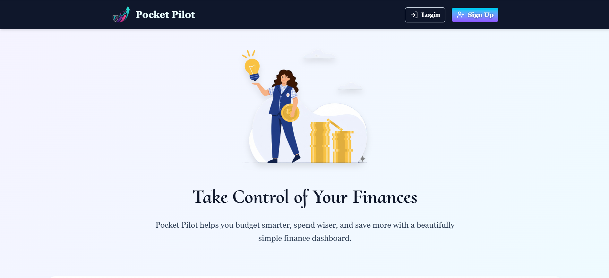

# [Pocket Pilot](https://pocket-pilot.onrender.com)

Pocket Pilot is a simple personal finance web app to track income, expenses, budgets and visualize spending with charts. 

> This may take 1-2 minutes to load data from server on first visit since we are using free-plan of onrender to host our backend server. It goes to sleep after 15 minutes of inactivity.

Visit the 👉🏻 [live demo](https://pocket-pilot.onrender.com) to see it in action!



## Key features

- User registration / login (email/password) and Google OAuth
- JWT-based authentication for protected routes
- Create, read, update, delete transactions
- Monthly budget storage and overspend alerts
- Charts and category breakdowns

## Tech stack

- Backend: Node.js, Express, Mongoose (MongoDB), Passport (Google OAuth), JWT
- Frontend: React, Vite, Tailwind CSS, Chart.js
- Dev tools: nodemon (server), vite (client)


## Local setup (quick)

1. Clone repo:
   ```bash
   git clone <repo-url>
   ```
2. Install server deps:
   ```bash
   cd server
   npm install
   ```
3. Install client deps:
   ```bash
   cd ../client
   npm install
   ```

## Running locally (dev)

- Start server (from `server/`):
  ```bash
  npm run dev
  ```
- Start client (from `client/`):
  ```bash
  npm run dev
  ```

## Contact

_For any inquiries or feedback, please contact:_

### Ravikant Tarare

📩 [ravikanttarare2001@gmail.com](mailto:ravikanttarare2001@gmail.com)

📞 [+91-8275957698](tel:+918275957698)